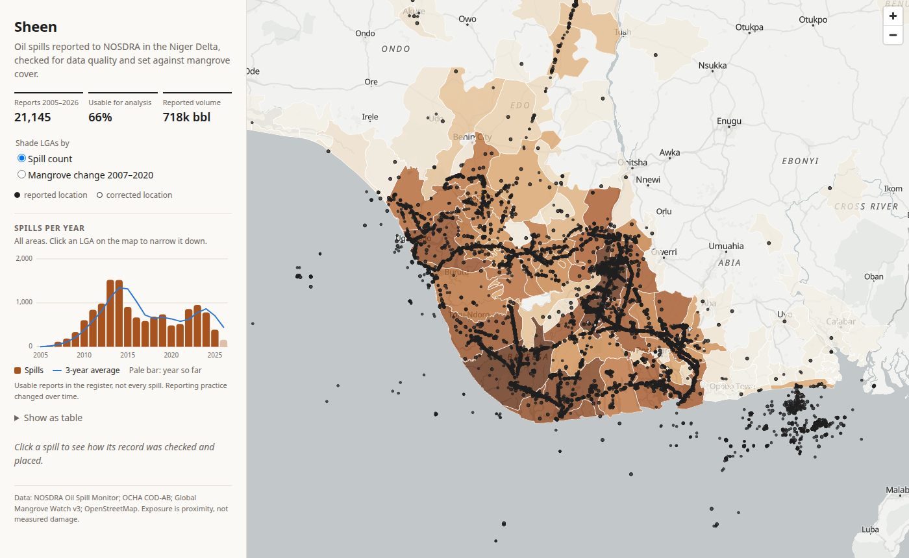
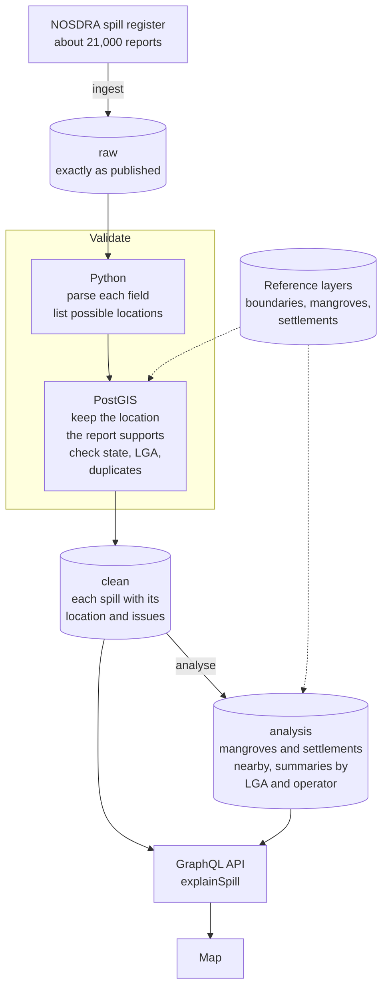

# Sheen

Sheen takes Nigeria's official oil spill reports, checks each one for
problems, fixes locations that were written down wrongly where it safely
can, and shows what was near each spill. The reports come from NOSDRA, the
National Oil Spill Detection and Response Agency.

## Why I built this

I was born and grew up in Port Harcourt, in the Niger Delta. My family is from
Ogoni, and oil spills have been part of life there for as long as I can
remember. I had never thought of building something like this until recently,
when I started looking at how location data collected in the field gets
checked and turned into something people can rely on. It made me want to do
the same for the spills back home.

The damage is well documented. In 2011 the UN Environment Programme found
families in Nsisioken Ogale, in Ogoniland, drinking well water with benzene
at over 900 times the WHO limit
([UNEP Ogoniland assessment](https://coastalcare.org/2011/08/oil-pollution-in-niger-delta-environmental-assessment-of-ogoniland-report-unep/)).
A 2017 study found that babies whose mothers lived within 10 km of a spill
before the pregnancy were twice as likely to die in their first month
([Bruederle and Hodler, CESifo](https://www.cesifo.org/DocDL/cesifo1_wp6653.pdf)).
The 2008 spills at Bodo destroyed mangroves and fishing grounds that about
15,600 fishermen depended on, and ended in a settlement with Shell in 2015
([Leigh Day](https://www.leighday.co.uk/news/cases-and-testimonials/cases/shell-bodo/)).

The official record tells a smaller story than the damage. The oil companies
lead the investigations that decide what caused a spill and how much
leaked, and when a spill is put down to sabotage, the community gets no
compensation
([Amnesty International](https://amnesty.org/en/wp-content/uploads/2021/05/AFR4479702018ENGLISH.pdf)).
Here is what the register shows for Ogoni's four local government areas
(Eleme, Gokana, Khana and Tai):

- 593 reports since 2005 can be placed in Ogoni. 155 of them can't be used:
  138 say there was no spill, 9 are marked invalid and 8 have no date.
- The first 2008 Bodo spill is recorded as 1,640 barrels, which is the oil
  company's own figure. An independent assessment for Amnesty put it at
  103,000 to 311,000 barrels
  ([Amnesty International](https://www.amnesty.org.uk/knowledge-hub/all-resources/shells-wildly-inaccurate-reporting-niger-delta-oil-spill-exposed/)).
- Neither of the 2008 Bodo spills has coordinates, so any map made from the
  register leaves out the best-known spills in Ogoni's recent history.

Sheen doesn't fix the register, but it makes it easier to see what the
register says and what it leaves out, for Ogoni and every other community in
the Delta:

- Every report with a usable location is on the map, and every report
  without one says why.
- For any spill, you can see exactly what the oil company reported and every
  step taken with it, so a journalist, researcher or community group can
  check the record for themselves.
- You can see which companies leave out locations, volumes or causes.
- You can see the mangroves and settlements near each spill.

The numbers are only as good as what the companies report, and the project
says so wherever it uses them.



## What the data shows

There are 21,145 reports from 2005 onwards, and 66% of them can be put on a
map and used. 22% have no usable location, and 9% are reports saying there
was no spill. Locations come in at least four formats, including Nigerian
grid coordinates and degrees-minutes-seconds with no spaces. 42 locations
were fixed, and only where the result lands in the state the report names.
How often companies leave out the location varies a lot: never for Heritage,
30% of the time for SPDC, and 64% for Chevron.

More in [docs/FINDINGS.md](docs/FINDINGS.md).

## How it works



1. **Ingest** downloads the whole register and saves it exactly as it was
   published. If nothing has changed since the last download, it stops
   there.
2. **Validate** reads each report in Python
   ([normalize.py](src/sheen/validation/normalize.py)), then checks the
   locations in PostGIS ([spatial.py](src/sheen/validation/spatial.py)).
   Every problem it finds is saved with the report. Serious problems keep a
   report out of the analysis; smaller ones just flag it. The limits it uses,
   like how close two reports must be to count as duplicates, are in
   [rules/v1.yaml](rules/v1.yaml).
3. When a location looks wrong, the Python step doesn't guess. It lists every
   way the numbers could be read, and PostGIS keeps the one that lands in the
   state the report names. If none does, the report is left without a
   location.
4. **Analyse** works out how much mangrove is within 1 km of each spill and
   which settlements are nearby, and builds summaries for each local
   government area and each company. Mangrove figures are saved for each
   location, so later runs only work them out for new ones.

Every run is logged in the database, and every result points back to the run
that made it. That is how `explainSpill` can show the full history of a
single report.

Why things are done this way is in [docs/DECISIONS.md](docs/DECISIONS.md).

## Stack

Python 3.12, FastAPI, Strawberry GraphQL, psycopg 3 with plain SQL,
PostgreSQL 16 with PostGIS 3.4, Alembic, GDAL, pytest with testcontainers,
Docker Compose, GitHub Actions, React with MapLibre.

## Running it

You need Docker, [uv](https://docs.astral.sh/uv/) and Node 22.

```bash
make up migrate       # start the database, then create the tables
make reference-data   # download the mangrove and OpenStreetMap files (about 760 MB)
make layers           # load boundaries, mangroves and settlements (once, about 15 minutes)
make run              # download the register, check it and analyse it
make api              # the API, with a query explorer at http://localhost:8000/graphql
make web              # the map at http://localhost:5173
```

A good first query:

```graphql
{
  explainSpill(id: "281734") {
    steps { step outcome }
    rawRecord
  }
}
```

To see how spills in an area changed over the years, click it on the map.
The side panel shows spills per year, with a three-year average. You can get
the same numbers from the trends endpoint, for example for Ogoni:

```
http://localhost:8000/trends?lga=Gokana,Khana,Tai,Eleme
```

It also accepts `state=RI`, `operator=SPDC` and `by=month`.

`make check` runs the linters and all the tests. Some tests start their own
PostGIS database in Docker. [docs/TESTING.md](docs/TESTING.md) explains how
to check everything by hand.

## Docs

- [FINDINGS.md](docs/FINDINGS.md): what the data shows, and what it can't
- [DECISIONS.md](docs/DECISIONS.md): why it's built the way it is
- [DATA_SOURCES.md](docs/DATA_SOURCES.md): where the data comes from
- [TESTING.md](docs/TESTING.md): how to check it works
- [WEAKNESSES.md](docs/WEAKNESSES.md): what isn't right yet

## Data

NOSDRA Oil Spill Monitor; OCHA administrative boundaries (CC BY-IGO); Global
Mangrove Watch v3.0 (CC BY 4.0); OpenStreetMap contributors (ODbL). Reports
from 2005 to the latest download.
