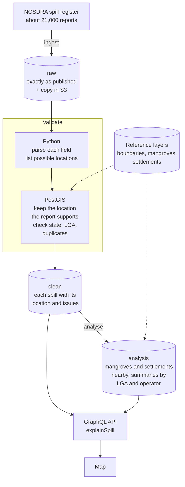

# Sheen

A pipeline and API for Nigeria's oil spill register. It loads the reports
published by NOSDRA (the National Oil Spill Detection and Response Agency),
checks every record, recovers coordinates that were published in the wrong
format, and works out what was near each spill: mangroves, settlements, and
the local government area (LGA).

## Why I built this

I was born and grew up in Port Harcourt, in the Niger Delta. My family is from
Ogoni, and oil spills have been part of life there for as long as I can
remember. I had never thought of building something like this until recently,
when I started looking at how location data collected in the field gets
checked and turned into something people can rely on. It made me want to do
the same for the spills back home.

The damage is well documented. In 2011 the UN Environment Programme found
families in Nsisioken Ogale, in Ogoniland, drinking well water with benzene
at over 900 times the WHO guideline
([UNEP Ogoniland assessment](https://coastalcare.org/2011/08/oil-pollution-in-niger-delta-environmental-assessment-of-ogoniland-report-unep/)).
A 2017 study found that babies whose mothers lived within 10 km of a spill
before the pregnancy were twice as likely to die in their first month
([Bruederle and Hodler, CESifo](https://www.cesifo.org/DocDL/cesifo1_wp6653.pdf)).
The 2008 spills at Bodo destroyed mangroves and fishing grounds that about
15,600 fishermen depended on, and ended in a settlement with Shell in 2015
([Leigh Day](https://www.leighday.co.uk/news/cases-and-testimonials/cases/shell-bodo/)).

The official record of these spills is thinner than the damage. Causes and
volumes come from investigations led by the operators themselves, and a spill
recorded as sabotage brings the community no compensation
([Amnesty International](https://amnesty.org/en/wp-content/uploads/2021/05/AFR4479702018ENGLISH.pdf)).
Looking at the register for Ogoni's four LGAs (Eleme, Gokana, Khana and Tai)
shows what that means in practice:

- 567 reports from 2005 to 2024 can be placed in Ogoni. 147 of them can't
  be used: 131 are recorded as "no spill", 8 are marked invalid and 8 have
  no date.
- The first 2008 Bodo spill is in the register as 1,640 barrels, the
  operator's figure. An independent assessment for Amnesty put it at 103,000
  to 311,000 barrels
  ([Amnesty International](https://www.amnesty.org.uk/knowledge-hub/all-resources/shells-wildly-inaccurate-reporting-niger-delta-oil-spill-exposed/)).
- Neither of the 2008 Bodo spills has coordinates, so any map made from the
  register leaves out the best-known spills in Ogoni's recent history.

Sheen doesn't fix the register, but it makes it easier to see what it says
and where it falls short, for Ogoni and for every other community in the
Delta:

- each report with a usable location is placed on a map with its LGA, and
  each one without says why;
- for any spill, `explainSpill` shows exactly what the operator published and
  every step taken with it, so a journalist, researcher or community group
  can check a record instead of trusting a summary;
- per-operator figures show who leaves out locations, volumes or causes;
- mangroves and settlements near each spill show what was at risk.

The numbers are only as good as what operators report, and the project
says so wherever it uses them.


## What the data shows

Of the 20,443 reports dated 2005 to 2024, 65% can be used for spatial
analysis. 23% have no usable location, and 9% are recorded as "no spill" in a
spill register. Coordinates arrive in at least four formats (decimal degrees,
Nigerian grid metres, packed degrees-minutes-seconds and misplaced decimal
points); 40 records were recovered, each only when the report's own state
agrees with the fix. The share of reports without a location ranges from 0%
(Heritage) to 30% (SPDC) and 65% (Chevron).

More in [docs/FINDINGS.md](docs/FINDINGS.md).

## How it works



1. Ingest stores each snapshot exactly as published, with its SHA-256, in
   Postgres and S3.
2. Validate parses each record in Python
   ([normalize.py](src/sheen/validation/normalize.py)) and then runs a set of
   PostGIS checks ([spatial.py](src/sheen/validation/spatial.py)). Problems are
   stored as typed issues with a severity: errors exclude a record from
   analysis, warnings flag it, info notes a correction. Thresholds live in a
   versioned ruleset ([rules/v1.yaml](rules/v1.yaml)).
3. For coordinates, the parser doesn't pick a fix. It lists every plausible
   reading (as published, swapped, reprojected from the Nigerian grids,
   decimal-shifted, DMS) and PostGIS keeps the one that lands in the state
   the report names.
4. Analyse measures mangrove area within 1 km of each spill and nearby
   settlements, and refreshes per-LGA and per-operator summaries.

Every stage writes a row to `ops.pipeline_runs` (row counts, source hash,
ruleset version, timings, errors), and every derived row points back to the
run that produced it. The API's `explainSpill(id)` uses that to show how a
single record went from the published JSON to its result.

Why things are done this way is in [docs/DECISIONS.md](docs/DECISIONS.md).

## Stack

Python 3.12, FastAPI, Strawberry GraphQL, psycopg 3 (plain SQL), PostgreSQL 16
with PostGIS 3.4, Alembic, GDAL for the reference layers, pytest with
testcontainers, Docker, GitHub Actions, React with MapLibre.

## Running it

You need Docker, [uv](https://docs.astral.sh/uv/) and Node 22.

```bash
make up migrate       # PostGIS and a local S3 (LocalStack), then the schema
make reference-data   # mangrove rasters and an OSM extract, about 760 MB
make layers           # boundaries, mangroves, settlements (one-off, ~15 min)
make run              # fetch NOSDRA, validate, analyse
make api              # GraphiQL at http://localhost:8000/graphql
make web              # the map at http://localhost:5173
```

A query to start with:

```graphql
{
  explainSpill(id: "281734") {
    steps { step outcome }
    rawRecord
  }
}
```

`make check` runs the linters, mypy and the tests. The integration tests start
their own PostGIS container. [docs/TESTING.md](docs/TESTING.md) covers manual
checks.

## Docs

- [FINDINGS.md](docs/FINDINGS.md): what the data shows and its limits
- [DECISIONS.md](docs/DECISIONS.md): design choices and why
- [DATA_SOURCES.md](docs/DATA_SOURCES.md): sources, licences, checks
- [PERFORMANCE.md](docs/PERFORMANCE.md): timings and optimisations
- [TESTING.md](docs/TESTING.md): how to verify it

## Data

NOSDRA Oil Spill Monitor; OCHA COD-AB (CC BY-IGO); Global Mangrove Watch v3.0
(CC BY 4.0); OpenStreetMap contributors (ODbL). Analysis window: 2005 to 2024.
